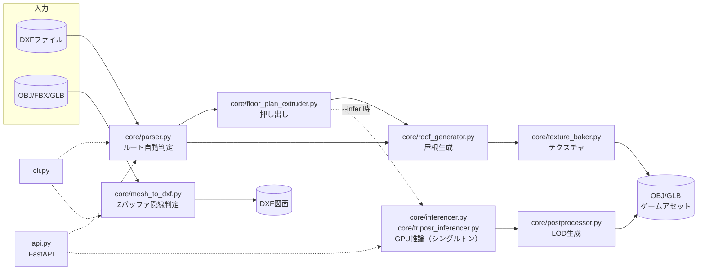
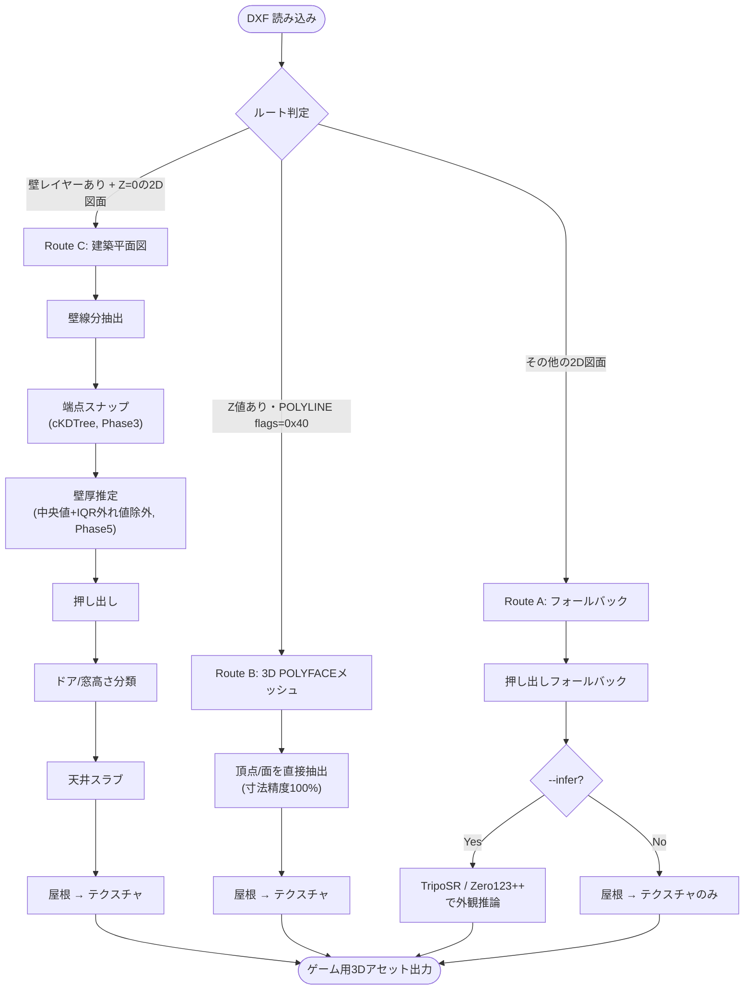
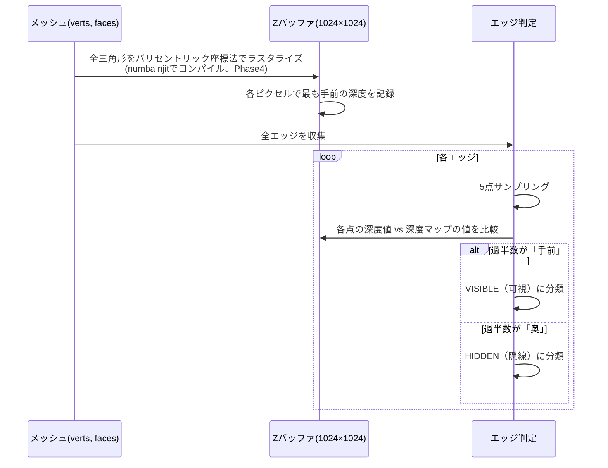
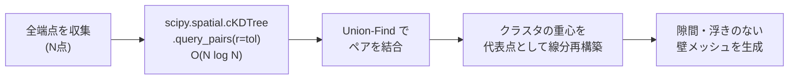
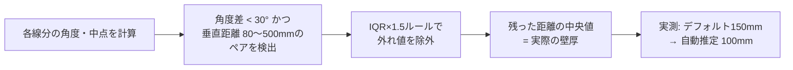
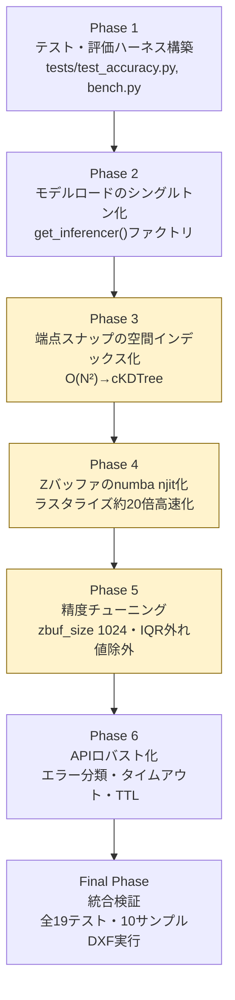
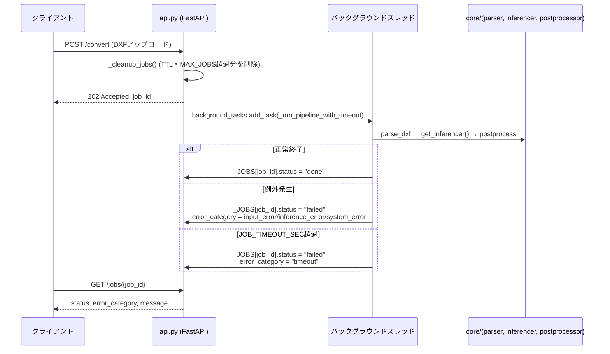

# CADGPUInferenceModeling — 技術概要

> CAD図面（DXF）↔ ゲーム用3Dアセット（OBJ/GLB）双方向変換パイプライン  
> 建築平面図・3D POLYFACEメッシュの自動変換 + GPU推論 + Zバッファ隠線判定

---

## 目次

1. [背景・目的](#背景目的)
2. [システム構成](#システム構成)
3. [処理ルートの自動判定](#処理ルートの自動判定)
4. [コアアルゴリズム](#コアアルゴリズム)
5. [精度・性能](#精度性能)
6. [性能・保守性改善（IMPROVEMENT_PLAN 実施結果）](#性能保守性改善improvement_plan-実施結果)
7. [技術スタック](#技術スタック)
8. [使い方](#使い方)
9. [テスト・API サーバー](#テストapi-サーバー)

---

## 背景・目的

ゲーム開発において建築・乗り物・設備を扱うタイトルでは、  
**「CAD図面 → ゲームアセット」の変換を手動でモデリングする工程**が存在し、コストが高い。

本プロジェクトはこの工程を **アルゴリズム + GPU推論** で自動化することを目的とする。  
逆方向（3Dモデル → DXF図面）も実装し、両方向で **寸法精度 100%** を達成した。

---

## システム構成

```
CADGPUInferenceModeling/
├── core/
│   ├── parser.py               DXFパース・ルート自動判定
│   ├── floor_plan_extruder.py  建築平面図 → 3Dメッシュ（v2: 5項目改善）
│   ├── mesh_renderer.py        メッシュ → シルエット画像（視点プリセット付き）
│   ├── roof_generator.py       屋根自動生成（陸屋根/片流れ/切妻）
│   ├── texture_baker.py        手続き的テクスチャ生成
│   ├── mesh_to_dxf.py          3Dメッシュ → DXF（Zバッファ隠線判定、numba njit高速化）
│   ├── inferencer.py           Zero123++ GPU推論（get_inferencer()シングルトン）
│   ├── triposr_inferencer.py   TripoSR GPU推論（get_inferencer()シングルトン）
│   └── postprocessor.py        LOD生成・エクスポート
├── cli.py                      CLIエントリ（run / export / info）
├── fbx2obj.py                  FBX → OBJ 変換（Blender経由）
├── api.py                      FastAPI サーバー（エラー分類・タイムアウト・ジョブTTL）
├── tests/                      pytest テスト・性能ベースライン計測
└── docs/PERF_RESULTS.md        性能改善の実測結果サマリー
```



---

## 処理ルートの自動判定

入力 DXF の種類を解析し、最適なルートで処理する。



---

## コアアルゴリズム

### 1. Zバッファ深度画像による隠線判定

3DモデルをDXF図面に変換する際の可視エッジ判定。  
GPU不使用・numpy のみでバリセントリック座標法を実装。

**処理フロー:**



**精度の改善履歴:**

| バージョン | 手法 | VISIBLE比率 |
|---|---|---|
| v1 | 深度中央値による単純分類 | 0.1% |
| v2 | 面法線による前面/背面判定 | 27.7% |
| v3 | Zバッファ深度画像（512×512、numpy） | 79.1% |
| v4（現行） | Zバッファ深度画像（**1024×1024**、**numba njit高速化**） | **80.5%** |

> 2026-07 の性能改善作業で、ラスタライズ内ループを numba njit 化(約20倍高速化)し、
> 深度マップ解像度を512→1024に引き上げた（[詳細](#性能保守性改善improvement_plan-実施結果)）。

**核心コード（numba njit化後、`_rasterize_faces`）:**

```python
@numba.njit(cache=True)
def _rasterize_faces(px_h, px_v, pts_d, faces, size):
    z_buf = np.full((size, size), np.inf, dtype=np.float32)
    for fi in range(faces.shape[0]):
        a, b, c = faces[fi, 0], faces[fi, 1], faces[fi, 2]
        h0, h1, h2 = px_h[a], px_h[b], px_h[c]
        v0, v1, v2 = px_v[a], px_v[b], px_v[c]
        d0, d1, d2 = pts_d[a], pts_d[b], pts_d[c]
        area = (h1 - h0) * (v2 - v0) - (h2 - h0) * (v1 - v0)
        if abs(area) < 0.5:
            continue
        for py in range(ymin, ymax):
            for px in range(xmin, xmax):
                w0 = ((h1-h2)*(px-h2) + (v2-v1)*(py-v2)) / area
                w1 = ((h2-h0)*(px-h0) + (v0-v2)*(py-v0)) / area
                w2 = 1.0 - w0 - w1
                if w0 >= -0.01 and w1 >= -0.01 and w2 >= -0.01:
                    depth = w0*d0 + w1*d1 + w2*d2
                    if depth < z_buf[py, px]:
                        z_buf[py, px] = depth
    return z_buf
```
`np.meshgrid`+ブールマスクのベクトル化から、三角形・ピクセルごとのネストループへ書き換えて
njitコンパイルした（同一アルゴリズム、境界条件・深度更新条件は完全に不変）。単体では
約20倍高速化を達成したが、大規模メッシュのtriview変換全体では
エッジ可視性判定・ezdxf書き出しが別のボトルネックだったため、体感速度の改善は限定的
だった（教訓は[技術資料の該当節](#性能保守性改善improvement_plan-実施結果)を参照）。

---

### 2. CP932 Mojibakeパターンマッチング

日本語CADソフトのDXFはレイヤー名がCP932エンコードされているが、  
ezdxfはcp1252 Mojibakeとして読み込む。  
キーワードを事前にCP932→cp1252変換してパターンマッチングを行う。

```python
def _cp932_moj(text: str) -> str:
    """CP932テキスト → ezdxf内部のcp1252 Mojibake文字列に変換"""
    b = text.encode("cp932")
    result = []
    for byte in b:
        if 0x80 <= byte <= 0xFF:
            try:
                result.append(bytes([byte]).decode("cp1252"))
            except ValueError:
                result.append(chr(0xDC00 + byte))  # surrogate
        else:
            result.append(chr(byte))
    return "".join(result)

# 壁1階/壁2階を自動検出
_WALL_MOJ   = [_cp932_moj("壁")]   # ezdxf内部: "•Ç" にマッチ
_FLOOR1_MOJ = [_cp932_moj("1階")]  # → Z = 0〜2500mm
_FLOOR2_MOJ = [_cp932_moj("2階")]  # → Z = 3000〜5500mm
```

---

### 3. Union-Find による端点スナップ（cKDTreeで空間インデックス化、Phase3）

壁線分の接合点が微妙にずれている問題を Union-Find で解決。  
80mm以内の近接端点をクラスタリングして重心に統合する。



> 元実装は全端点ペアを二重ループで距離判定するO(N²)だった。2026-07に
> `cKDTree.query_pairs`によるO(N log N)へ置換（Union-Find自体は不変）。
> ただし手元のサンプル（端点300程度）ではO(N²)自体が支配的コストではなく、
> 実際のボトルネックは別処理（開口部カットのブーリアン演算）だったと判明している。

---

### 4. 平行線ペア検出による壁厚自動推定（中央値+IQR外れ値除外、Phase5）

建築CADの壁は2本の平行線で表現される慣習を利用。



---

### 5. 建築平面図 v2 の5項目改善

| 項目 | 改善内容 | 効果 |
|---|---|---|
| ① 端点スナップ | Union-Find (tol=80mm) | 壁の隙間・浮きを解消 |
| ② 壁厚自動推定 | 平行線ペア検出 | 150mm → 実測100mmに修正 |
| ③ 開口部高さ分類 | 線分長さでドア/窓を判別 | ドア(床〜2m)・窓(90cm〜2m) |
| ④ 複数階統合 | レイヤー名から階数を検出 | 1階+2階を正確に積み上げ |
| ⑤ 天井スラブ | 各階天井に150mm板を追加 | 建物としてのリアリティ向上 |

---

## 精度・性能

### 寸法精度（DXF → OBJ, car.dxf 実測）

| 軸 | 元DXF | 生成OBJ | 誤差 |
|---|---|---|---|
| 幅（X） | 2160.0mm | 2160.0mm | **0.0mm** |
| 奥行（Y） | 4853.0mm | 4853.0mm | **0.0mm** |
| 高さ（Z） | 1702.0mm | 1702.0mm | **0.0mm** |

### 建築平面図 押し出し実測（2DDXF_Sample.dxf）

```
1階壁線分:  61本 (Z=0〜2500mm)
2階壁線分:  97本 (Z=3000〜5500mm)
壁厚推定:   100mm（平行線対から自動算出）
完成メッシュ: verts=1098, faces=1932
高さ:       -0.20〜5.65m（2階建て正確に再現）
```

### 処理時間（RTX 3070 / 8.6GB VRAM）

| 処理 | 時間 | GPU |
|---|---|---|
| 押し出し+屋根+テクスチャ（建築図面、壁156本規模） | 約2分 | 不使用（開口部カットのブーリアン演算が支配的） |
| TripoSR 推論（256res） | ~30秒 | ~6GB |
| 3Dメッシュ→DXF変換（車1台規模） | 約10秒 | 不使用 |
| 3Dメッシュ→DXF変換（5万頂点超の大規模メッシュ） | 約50秒 | 不使用（ラスタライズはnumba化済み、エッジ判定ループが支配的） |

数値の詳細と計測条件は [docs/PERF_RESULTS.md](docs/PERF_RESULTS.md) を参照。

---

## 性能・保守性改善（IMPROVEMENT_PLAN 実施結果）

2026-07、評価ハーネス駆動で6フェーズの性能・保守性改善を実施した
（[IMPROVEMENT_PLAN.md](IMPROVEMENT_PLAN.md) / [docs/PERF_RESULTS.md](docs/PERF_RESULTS.md)）。
各フェーズは「実装 → 独立レビューによる検証 → 検証済みのみコミット」のプロセスで進めた。



黄色（Phase 3・4・5）は「実装は完了したが、実測の結果、当初の想定通りには
効果が出なかった、または一部の変更を差し戻した」フェーズ。

### 確実に達成した改善

| フェーズ | 改善内容 | 実測結果 |
|---|---|---|
| Phase 2 | モデル多重ロードの解消 | APIリクエストごとのTripoSR(1.7GB)/Zero123++(5.6GB)再ロードを構造的に防止 |
| Phase 4 | Zバッファラスタライズのnumba化 | boat.obj(52,913頂点)で約4.1秒→約0.2秒（**約20倍**） |
| Phase 5 | 可視率の実測ベース改善 | car.dxfで79.1%→**80.5%**（zbuf_size 512→1024） |
| Phase 6 | APIの障害耐性向上 | エラー分類(input/inference/timeout/system)・ジョブストアのメモリリーク防止 |

### 想定と実測が食い違った、実務上重要な発見

| フェーズ | 当初の想定 | 実測結果 |
|---|---|---|
| Phase 3 | 端点スナップのO(N²)が押し出し処理のボトルネック | スナップ自体は0.0025秒。真のボトルネックは開口部カットの`trimesh.boolean.difference`（約2分の大半を占める） |
| Phase 4 | ラスタライズのnumba化で隠線判定が18秒→4秒に | ラスタライズ単体は20倍高速化したが、大規模メッシュのtriview変換全体は改善せず。真のボトルネックはエッジ可視性判定のPythonループ(40万本超)とezdxf書き出し |
| Phase 5 | `wall_snap_tol`を推定壁厚の±5%に動的化すれば誤結合が減る | 独立レビューで実測した結果、下限10mmでは端点未統合(隙間残存)が155本中43本で発生するリグレッションを確認。**採用を見送り、固定値に差し戻した** |

**教訓**: プロファイリングなしの直感的なボトルネック予測は外れることが多い。
評価ハーネス（Phase 1で最初に構築）とベンチマークによる実測、および独立した
レビューによる検証があったからこそ、効果のない変更・リグレッションを本番投入前に
検出できた。

---

## 技術スタック

| カテゴリ | ライブラリ | 用途 |
|---|---|---|
| CAD処理 | ezdxf | DXF読み書き |
| 3Dメッシュ | trimesh | メッシュ処理・エクスポート |
| 幾何演算 | shapely, scipy | 2Dポリゴン・Union-Find |
| 数値計算 | numpy | Zバッファ・行列演算 |
| GPU推論 | PyTorch + CUDA | TripoSR・Zero123++ |
| 深度推定 | Depth-Anything-V2 | 単眼深度推定 |
| API | FastAPI + typer | サーバー・CLI |
| 画像処理 | Pillow, matplotlib | レンダリング・前処理 |
| 高速化 | numba | Zバッファラスタライズのnjitコンパイル |
| テスト | pytest | 寸法精度・可視率・シングルトン・APIエラー分類の回帰テスト |

---

## 使い方

### DXF → 3Dアセット

```bash
# 推論なし（押し出し+屋根+テクスチャ）
python cli.py run building.dxf --output-dir ./out

# TripoSR推論あり
python cli.py run building.dxf --output-dir ./out --infer --model triposr

# 陸屋根 + コンクリートテクスチャ
python cli.py run building.dxf --output-dir ./out --roof-type flat --wall-style concrete
```

### 3Dモデル → DXF図面

```bash
# OBJ → 三面図+平面図（Zバッファ隠線判定付き）
python cli.py export model.obj

# 隠線なし・三面図のみ
python cli.py export model.obj --mode triview --no-hidden

# FBX は事前変換
python fbx2obj.py model.fbx
python cli.py export model.obj
```

---

## テスト・API サーバー

### テスト

```bash
# 単体テスト（寸法精度・Zバッファ可視率・モデルシングルトン・APIエラー分類）
python -m pytest tests/ -v

# 処理時間の計測（tests/baseline.json を更新）
python tests/bench.py
```

### API サーバー



```bash
uvicorn api:app --reload --host 0.0.0.0 --port 8000
```

| 環境変数 | デフォルト | 説明 |
|---|---|---|
| `PRELOAD_MODELS` | 未設定 | `1`で起動時にZero123++を事前ロード |
| `JOB_TIMEOUT_SEC` | 600 | ジョブタイムアウト秒数 |
| `MAX_JOBS` | 500 | ジョブストア最大保持件数 |
| `JOB_TTL_SEC` | 3600 | 完了済みジョブの保持時間 |

---

## 入手できるテストデータ

| サイト | URL | 形式 | 内容 |
|---|---|---|---|
| Free3D | free3d.com/3d-models/dxf | 3D POLYFACE DXF | 車・建物・動物など174種 |
| 3D ContentCentral | 3dcontentcentral.com | DXF/STEP | 高品質な機械部品 |
| CADblocksfree.com | cadblocksfree.com | 2D DXF | 建築平面図 |
| GrabCAD | grabcad.com | DXF/FBX/OBJ | 何でも |
